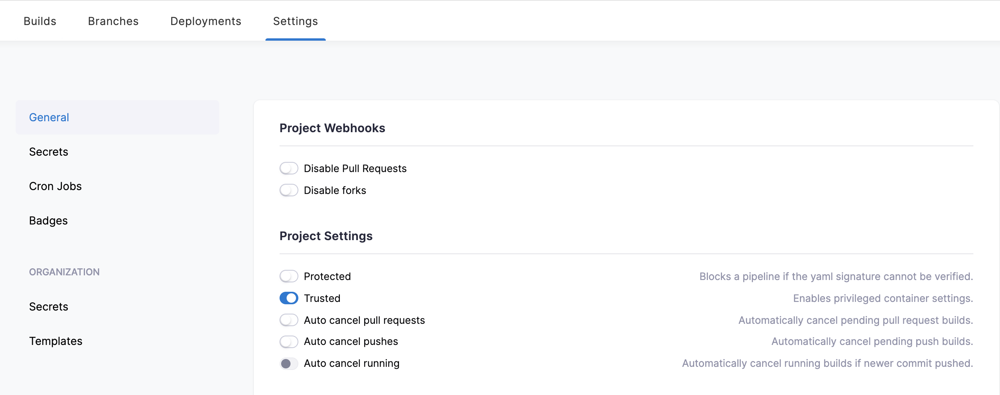

# Speedup Build Time on Drone CI

I use drone ci to build and deploy my github pages. Like that i don't have to wait for a free github runner and have a more or less constant build time. My initial Pipeline had three stages:


<!--truncate-->

The `website` Stage, where the static page is compiled with Webpacker, consumed the most time. No big deal for pages with few dependencies (e.g. a clean install of Docusaurus), where a complete build takes around 1 minute on a [Hetzner CPX41](https://www.hetzner.com/cloud) (8 VCPUs, *AMD EPYC 2nd* with 16 GB Ram). But for pages with many dependecies it took me around 8 minutes for the page to be built.

So i decided to add caching to my pipeline. Since memory on my server isn't a problem for the moment, i'm using *volume cache* directly on my server. To do so, i configured the `.drony.yml` file with two additional stages:


I used the [drone-volume-cache](https://github.com/Drillster/drone-volume-cache) from [@drillster](https://github.com/Drillster) and followed the instructions on the [docs page](https://github.com/Drillster/drone-volume-cache/blob/master/DOCS.md).

## Configure Drone Server

Because my drone ci is deployed with [Dokku](https://lebalz/synopsis/dokku/drone-ci), the cache will be typically under `/var/lib/dokku/data/storage/<app-name>`.

```bash
# create persistent directory for caching
mkdir -p /var/lib/dokku/data/storage/drone-runner/cache
```

The drone server itself will spawn the drone runner with a mounted volume. To do so, the repository, needs to be "Trusted". This flag can only be set as an admin. So ensure you configured yourself as an admin:

```bash
# replace foobar with your github username
dokku config:set drone-server DRONE_USER_CREATE=username:foobar,admin:true
```

And set the trusted flag under `Settings>General>Project Settings` for the repository you like to cache:



## `.drone.yml`

Finally, add the highlighted code blocks to your drone config file.  
```yml {3-11,14-22,25-28}
steps:
# first step
- name: restore-cache
  image: drillster/drone-volume-cache
  volumes:
  - name: cache
    path: /cache
  settings:
    restore: true
    mount:
      - ./node_modules
# ...
# last step
- name: rebuild-cache
  image: drillster/drone-volume-cache
  volumes:
  - name: cache
    path: /cache
  settings:
    rebuild: true
    mount:
      - ./node_modules
# ...
# add volume
volumes:
  - name: cache
    host:
      path: /var/lib/dokku/data/storage/drone-runner/cache
```

<details><summary>Full .drone.yml</summary>

```yml title=.drone.yml
---
kind: pipeline
type: docker
name: default

steps:
- name: restore-cache
  image: drillster/drone-volume-cache
  volumes:
  - name: cache
    path: /cache
  settings:
    restore: true
    mount:
      - ./node_modules

- name: website
  image: node:16.11.1
  commands:
  - mkdir -p $HOME/.ssh
  - ssh-keyscan -t rsa github.com >> $HOME/.ssh/known_hosts
  - echo "$GITHUB_PRIVATE_KEY" > "$HOME/.ssh/id_rsa"
  - chmod 0600 $HOME/.ssh/id_rsa
  - yarn install --frozen-lockfile
  - npm run deploy
  environment:
    USE_SSH: true
    GIT_USER: $DRONE_COMMIT_AUTHOR
    GITHUB_PRIVATE_KEY:
      from_secret: "git_deploy_private_key"
  when:
    event:
      include:
      - push
      - pull_request

- name: rebuild-cache
  image: drillster/drone-volume-cache
  volumes:
  - name: cache
    path: /cache
  settings:
    rebuild: true
    mount:
      - ./node_modules

volumes:
  - name: cache
    host:
      path: /var/lib/dokku/data/storage/drone-runner/cache

trigger:
  branch:
  - main
```

</details>

## Conclusion 🚀

With the added cache stages, the build time on my big page could be reduced from 8 minutes to 3:30 minutes 🚀. For lightweight pages it takes now around 15 seconds for a small change to be deployed, yay 🥳