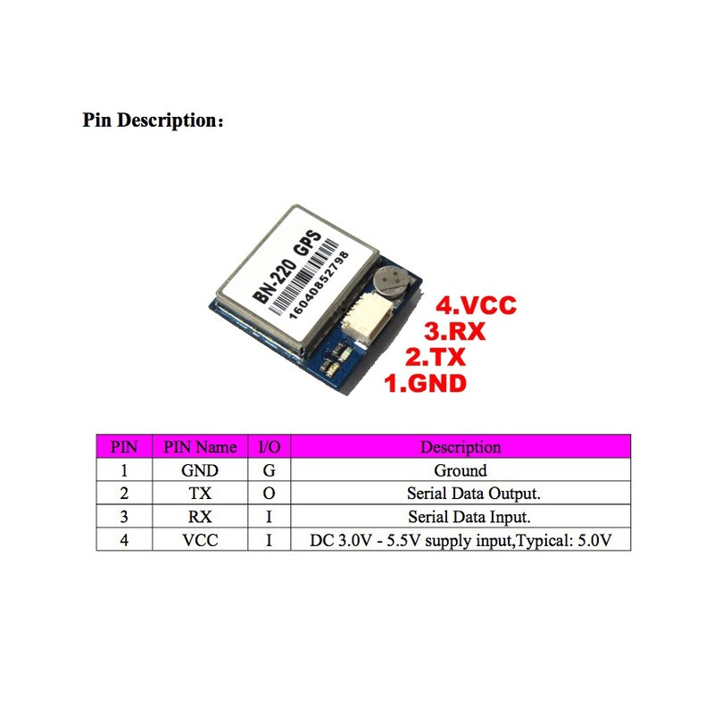

# GPS BN-220



```
GND (black) -> GND
TX (white) -> 4 (to arduinos RX Pin)
RX (green/yellow) -> 3 (to arduinos TX Pin)
VCC (red) -> 5V
```

## Basic Example - Read NMEA Data

Only display the raw NMEA data. Only SoftwareSerial is used. Check [👉 GPS Tutorial](https://github.com/StuartsProjects/GPSTutorial) for troubleshooting or when using hardware serial instead (esp32).

```ino reference
https://github.com/lebalz/blog/blob/main/docs/arduino/gps-bn-220/gps-basic-example.ino
```

## Using TinyGPS++ Library

With the TinyGPS++ library, you can parse the NMEA data and get the latitude, longitude, altitude, speed, date, time, etc.

Download the latest version of the library from [👉 TinyGPS++](https://github.com/mikalhart/TinyGPSPlus/releases/tag/v1.0.3a) and install it in the Arduino IDE.

```ino reference
https://github.com/lebalz/blog/blob/main/docs/arduino/gps-bn-220/gps-bn-220.ino
```

